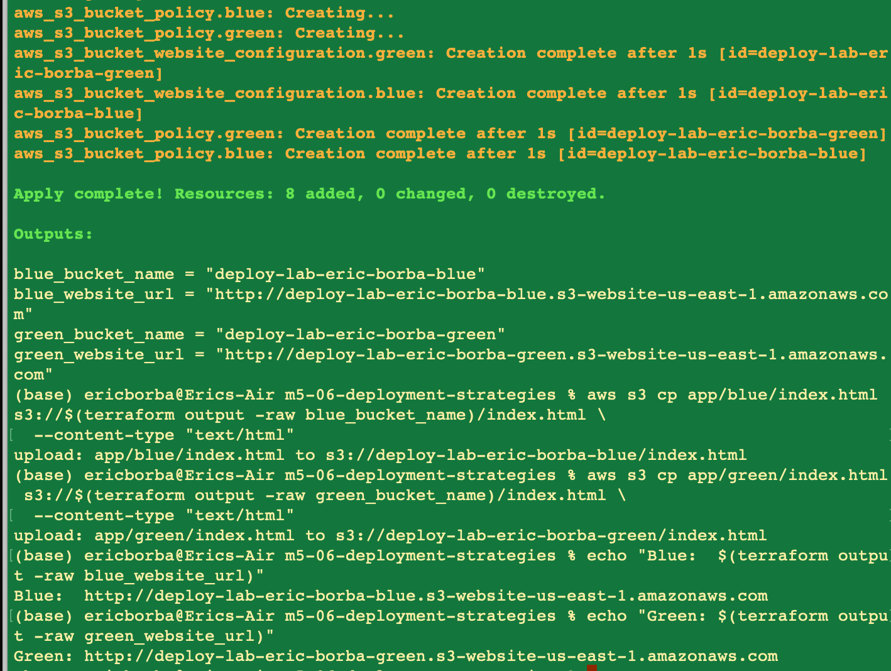
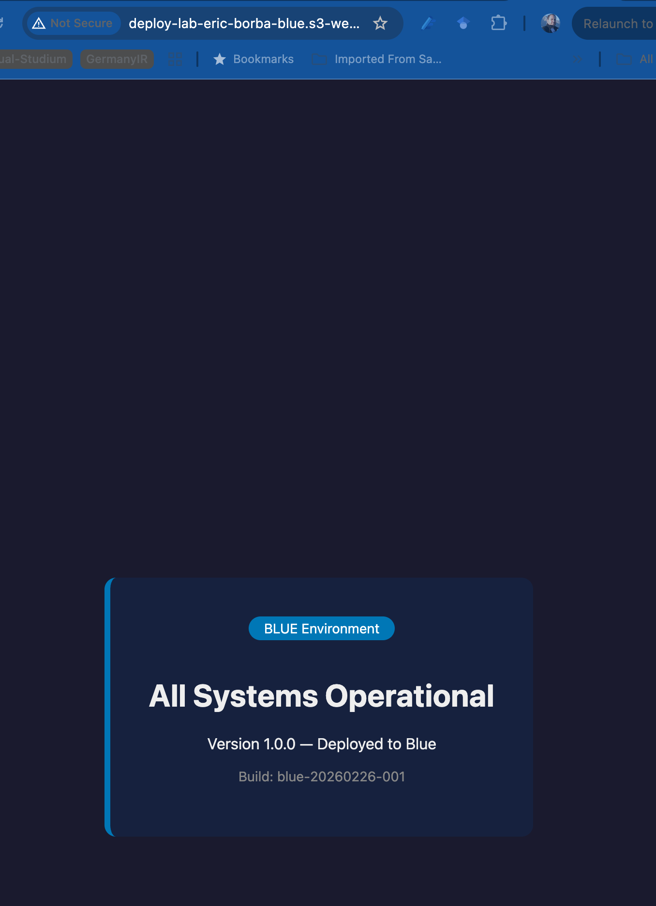
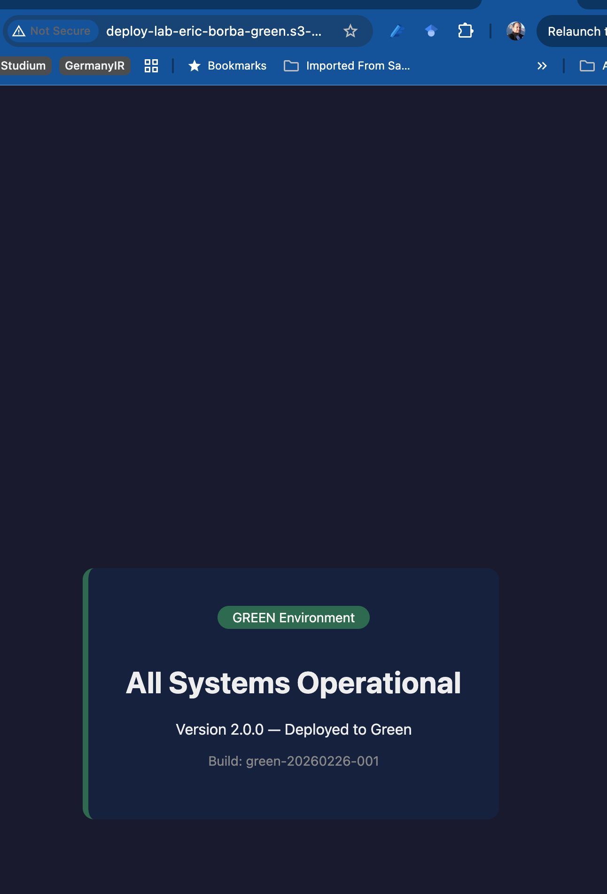
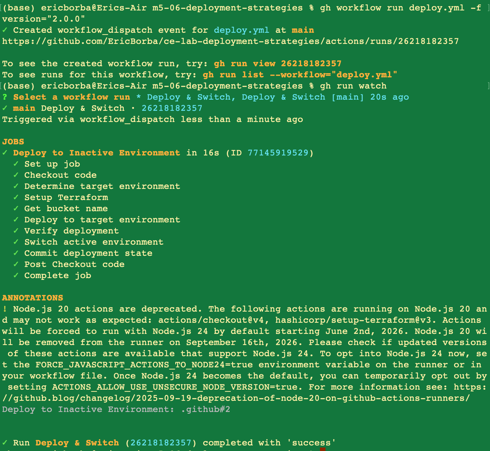
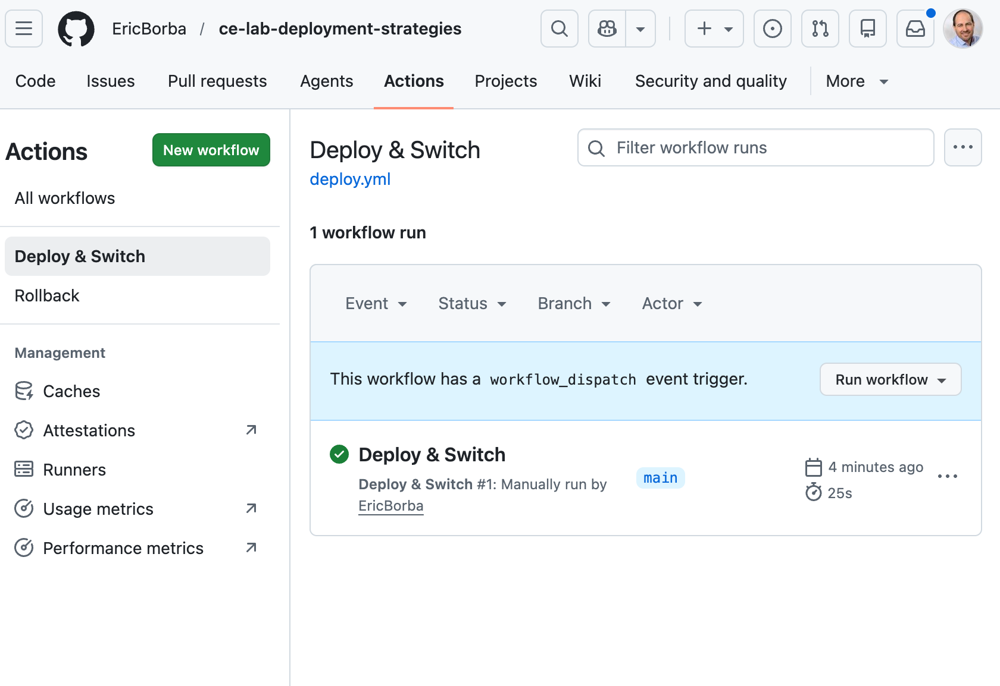
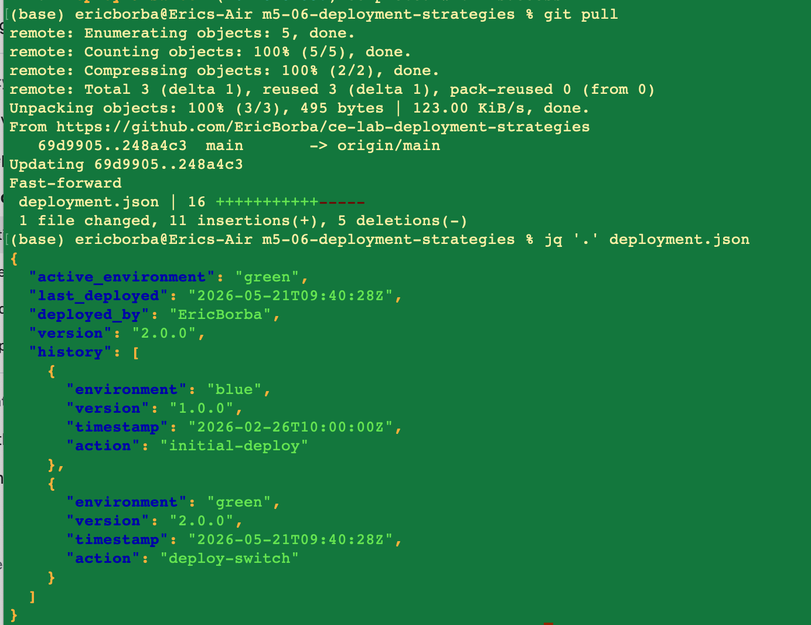
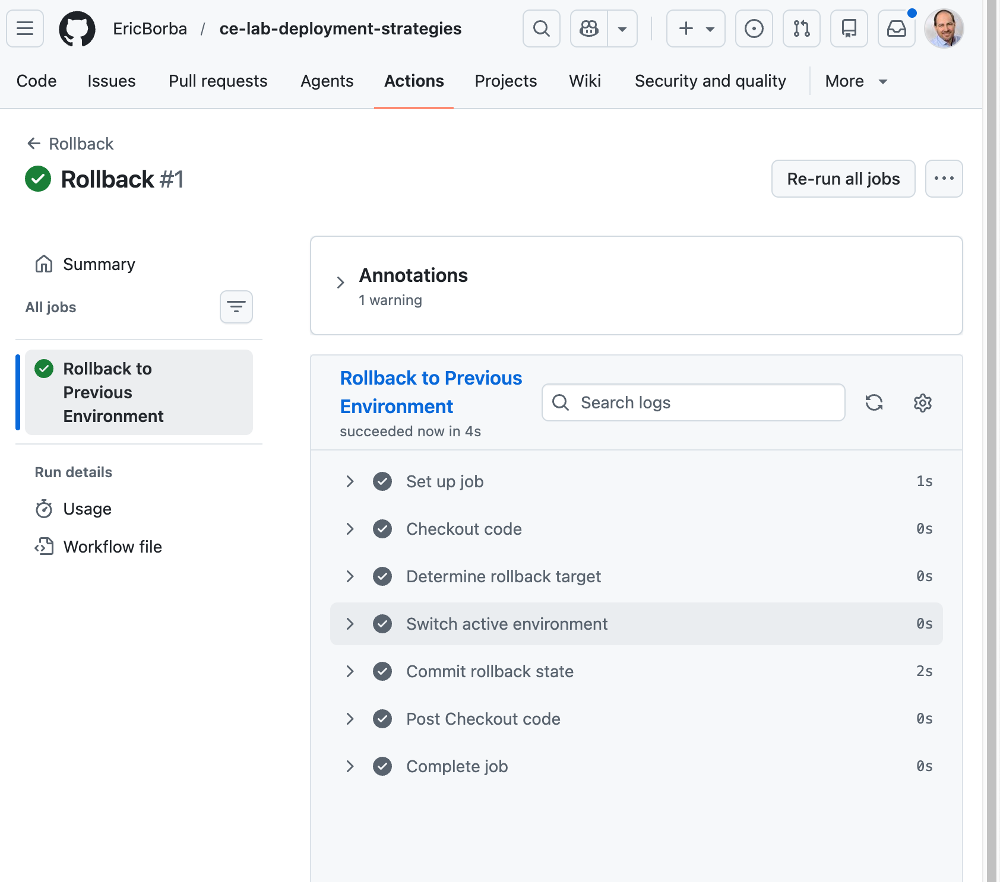
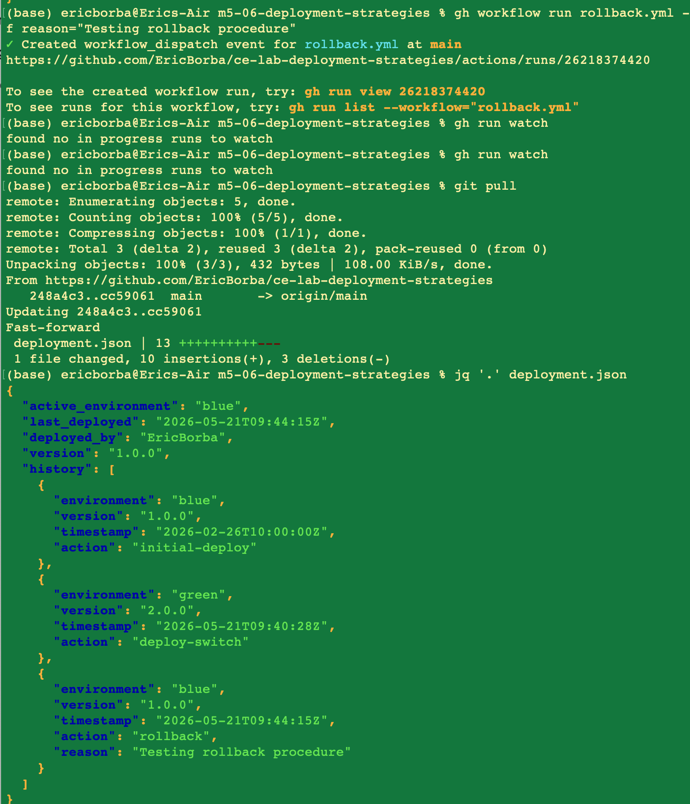

# Lab M5-06 — Blue/Green Deployment Strategies on AWS

## Overview

This lab implements a **blue/green deployment strategy** using AWS S3 static website hosting and GitHub Actions. Two identical environments (blue and green) run in parallel; traffic is switched between them with zero downtime by updating a `deployment.json` state file. A rollback workflow allows instant reversion to the previous environment.

## Architecture

```
┌─────────────────────────────────────────────────────────┐
│                    GitHub Actions                        │
│  ┌──────────────────────┐  ┌──────────────────────────┐ │
│  │   deploy.yml         │  │   rollback.yml            │ │
│  │  (Deploy & Switch)   │  │  (Rollback)               │ │
│  └──────────┬───────────┘  └─────────────┬────────────┘ │
└─────────────┼─────────────────────────────┼─────────────┘
              │                             │
              ▼                             ▼
     ┌────────────────┐           ┌────────────────┐
     │  S3 Bucket     │           │  S3 Bucket     │
     │  (BLUE)        │           │  (GREEN)       │
     │  v1.0.0        │◄──────────│  v2.0.0        │
     │  [ACTIVE] ◄────┼─ switch ──┼─────────────── │
     └────────────────┘           └────────────────┘
```

Both S3 buckets are always running. Switching "active" environments means deploying the new version to the idle bucket, verifying it, and updating the state file — no DNS changes, no downtime.

## Infrastructure

Provisioned via Terraform (`main.tf`):

| Resource | Name | Purpose |
|---|---|---|
| `aws_s3_bucket` | `deploy-lab-eric-borba-blue` | Blue environment hosting |
| `aws_s3_bucket` | `deploy-lab-eric-borba-green` | Green environment hosting |
| `aws_s3_bucket_website_configuration` | blue / green | Static website config (index.html) |
| `aws_s3_bucket_public_access_block` | blue / green | Allow public read access |
| `aws_s3_bucket_policy` | blue / green | Public `s3:GetObject` policy |

**Variables:**

| Variable | Default | Description |
|---|---|---|
| `aws_region` | `us-east-1` | AWS region |
| `project_name` | `deploy-lab-eric-borba` | Prefix for bucket names |

**Outputs:**

| Output | Description |
|---|---|
| `blue_website_url` | S3 static website URL for blue |
| `green_website_url` | S3 static website URL for green |
| `blue_bucket_name` | Blue bucket name |
| `green_bucket_name` | Green bucket name |

## Project Structure

```
m5-06-deployment-strategies/
├── .github/
│   └── workflows/
│       ├── deploy.yml              # Deploy & Switch workflow (tested)
│       ├── rollback.yml            # Rollback workflow (tested)
│       └── deploy-with-safe.yml    # Safe Deploy with Auto-Rollback (not tested)
├── app/
│   ├── blue/
│   │   └── index.html              # Blue environment app (v1.0.0)
│   └── green/
│       └── index.html              # Green environment app (v2.0.0)
├── screenshots/                    # Lab evidence
├── canary-router.js                # CloudFront Function for canary routing (not tested)
├── deployment.json                 # Active environment state tracker
├── main.tf                         # Terraform infrastructure
├── variables.tf
└── outputs.tf
```

## Deployment State (`deployment.json`)

The `deployment.json` file is the source of truth for which environment is active. It is updated automatically by the GitHub Actions workflows on every deploy or rollback.

```json
{
  "active_environment": "blue",
  "last_deployed": "2026-05-21T09:44:15Z",
  "deployed_by": "EricBorba",
  "version": "1.0.0",
  "history": [...]
}
```

## GitHub Actions Workflows

### Deploy & Switch (`deploy.yml`)

Triggered manually via `workflow_dispatch` with a `version` input.

**Steps:**
1. Reads `deployment.json` to determine the currently active environment
2. Targets the **inactive** environment (if blue is active → deploy to green)
3. Uploads `app/<target>/index.html` to the target S3 bucket
4. Verifies the target URL returns HTTP 200 before switching
5. Updates `deployment.json` (flips `active_environment`, records history)
6. Commits and pushes the updated state file

### Rollback (`rollback.yml`)

Triggered manually via `workflow_dispatch` with a `reason` input.

**Steps:**
1. Reads the current active environment from `deployment.json`
2. Switches to the opposite environment (no file upload needed — it's already there)
3. Requires at least 2 entries in history; exits with error if history is too short
4. Updates `deployment.json` with rollback action and reason
5. Commits and pushes the updated state file

## Required GitHub Secrets

| Secret | Description |
|---|---|
| `AWS_ACCESS_KEY_ID` | IAM user access key with S3 write permissions |
| `AWS_SECRET_ACCESS_KEY` | IAM user secret key |

## Lab Walkthrough

### Step 1 — Provision Infrastructure with Terraform

```bash
terraform init
terraform apply
```

Terraform creates both S3 buckets with public website hosting enabled.



### Step 2 — Initial Deployment

With the buckets created, the app files were uploaded manually to confirm both environments serve content correctly.

**Blue environment (v1.0.0) — initial active state:**



**Green environment (v2.0.0) — idle, ready for next release:**



### Step 3 — Run the Deploy & Switch Workflow

The `deploy.yml` workflow was triggered via the GitHub CLI:

```bash
gh workflow run deploy.yml -f version="2.0.0"
gh run watch
```

The workflow deployed v2.0.0 to the green bucket, verified its health, and switched the active environment from blue → green.





After the run, pulling the repo shows the updated `deployment.json` with `active_environment: "green"`:



### Step 4 — Run the Rollback Workflow

A rollback was triggered to simulate reverting a bad release:

```bash
gh workflow run rollback.yml -f reason="Testing rollback procedure"
```

The workflow switched the active environment back to blue without any file uploads — the previous version was already live in the blue bucket.



After pulling, `deployment.json` shows `active_environment: "blue"` with the rollback entry recorded in history:



## Deployment History

The final state of `deployment.json` after the full lab cycle:

| # | Environment | Version | Action | Timestamp |
|---|---|---|---|---|
| 1 | blue | 1.0.0 | initial-deploy | 2026-02-26T10:00:00Z |
| 2 | green | 2.0.0 | deploy-switch | 2026-05-21T09:40:28Z |
| 3 | blue | 1.0.0 | rollback | 2026-05-21T09:44:15Z |

---

## Untested Extensions

> **Note:** The resources and workflows in this section were written as extensions to the lab but **have not been executed or validated**. They are included here as design references only.

### Safe Deploy with Auto-Rollback (`deploy-with-safe.yml`)

An enhanced version of `deploy.yml` that adds an automatic rollback safety net. Instead of verifying the target environment *before* switching, it switches first and then runs a post-switch health check. If the health check fails, the workflow automatically reverts `deployment.json` to the previous environment without any manual intervention.

**How it differs from `deploy.yml`:**

| | `deploy.yml` | `deploy-with-safe.yml` |
|---|---|---|
| Health check timing | Before switch | After switch |
| On failure | Aborts, no switch | Auto-reverts state |
| Retries | None | 3 attempts with 5s delay |
| Rollback trigger | Manual | Automatic |

**Steps:**
1. Determines active and target environments from `deployment.json`
2. Uploads `app/<target>/index.html` to the target S3 bucket
3. Updates `deployment.json` to flip the active environment
4. Runs a post-switch health check with 3 retries (`continue-on-error: true`)
5. If health check output is `healthy=false` → automatically rolls back `deployment.json` to the previous environment
6. Commits the final state (either the successful switch or the auto-rollback)

**Auto-rollback log entry example:**
```json
{
  "environment": "blue",
  "action": "auto-rollback",
  "reason": "health-check-failed"
}
```

### Canary Deployment (`canary-router.js` + CloudFront)

A canary deployment pattern that gradually shifts a percentage of traffic to the green environment while keeping the majority on blue. This allows real-user testing of a new release before a full switch.

**`canary-router.js`** — a CloudFront Function that runs on every viewer request:

```js
function handler(event) {
  var weight = 10; // percentage to green
  var rand = Math.random() * 100;
  if (rand < weight) {
    var request = event.request;
    request.origin = { s3: { domainName: 'deploy-lab-green.s3.amazonaws.com' }};
    return request;
  }
  return event.request;
}
```

With `weight = 10`, approximately 10% of requests are routed to green; the remaining 90% stay on blue.

**Terraform resources (in `main.tf`):**

| Resource | Purpose |
|---|---|
| `aws_cloudfront_distribution.canary` | Distribution with both S3 buckets as origins |
| `var.canary_weight` | Configurable traffic split percentage (0–100, default 10) |
| `output.cloudfront_url` | CloudFront URL for the canary distribution |

The CloudFront distribution is configured with a `blue-green` origin group and failover criteria on 5xx errors (500, 502, 503, 504), meaning CloudFront will automatically fall back to the secondary origin if the primary returns a server error.

**Architecture (canary mode):**

```
                    ┌──────────────────────────┐
User Request ──────►│  CloudFront Distribution  │
                    │   (canary-router.js)       │
                    └──────────┬───────────────-┘
                               │
               ┌───────────────┴───────────────┐
            90%│                               │10%
               ▼                               ▼
      ┌────────────────┐             ┌────────────────┐
      │  S3 (BLUE)     │             │  S3 (GREEN)    │
      │  v1.0.0        │             │  v2.0.0        │
      └────────────────┘             └────────────────┘
```

**Variable:**

| Variable | Default | Description |
|---|---|---|
| `canary_weight` | `10` | Percentage of traffic routed to green (0–100) |

---

## Key Concepts Demonstrated

- **Blue/Green deployment** — two identical environments with instant switchover
- **Zero-downtime deployments** — the inactive environment is fully verified before traffic switches
- **Automated rollback** — a single workflow dispatch reverts to the previous known-good state in seconds
- **Deployment state tracking** — `deployment.json` provides an auditable history of every deploy and rollback
- **Infrastructure as Code** — all S3 resources provisioned and managed with Terraform
- **CI/CD via GitHub Actions** — fully automated pipeline with `workflow_dispatch` triggers
- **Auto-rollback safety net** *(designed, not tested)* — post-switch health check with automatic state reversion on failure
- **Canary deployments** *(designed, not tested)* — CloudFront Function + origin group for gradual traffic splitting
